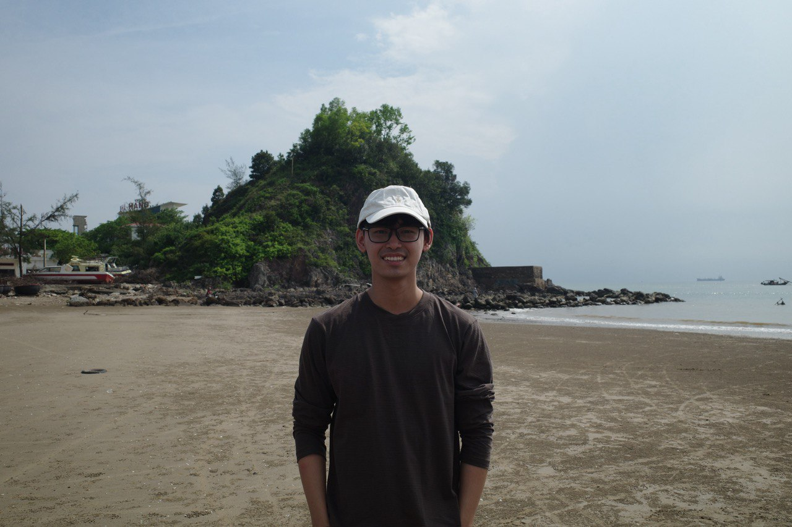
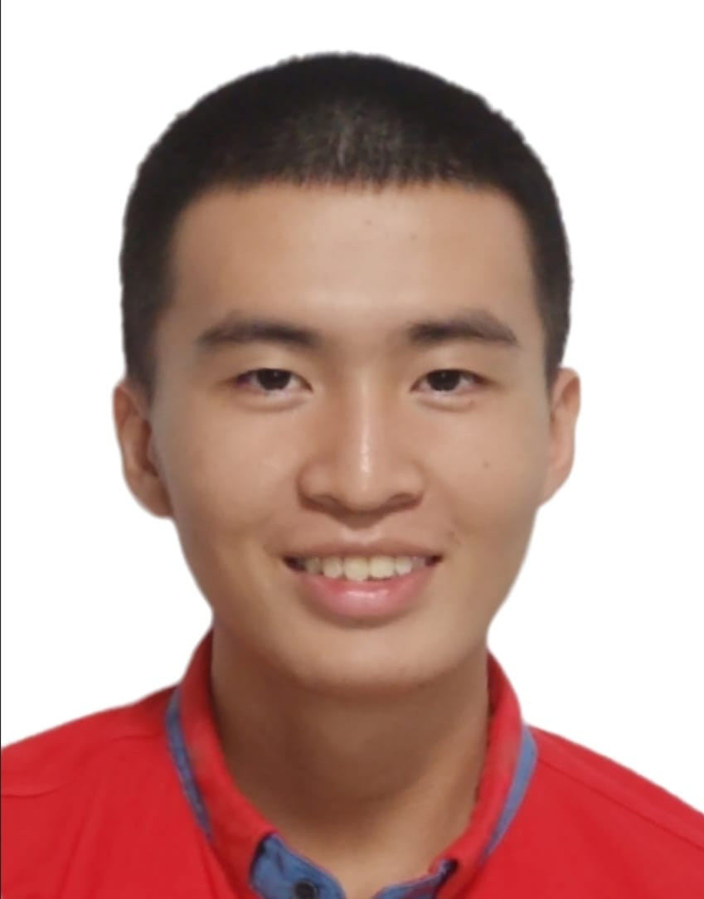
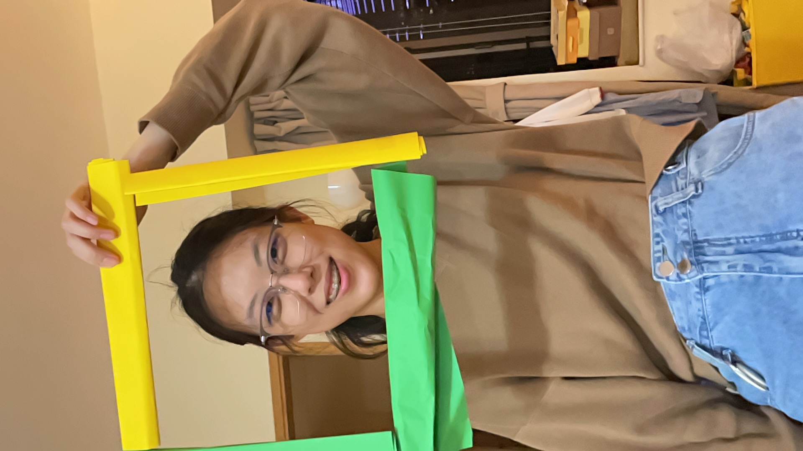

We are a team based in the [School of Computing, National University of Singapore](https://www.comp.nus.edu.sg).

You can reach us at the email `seer[at]comp.nus.edu.sg`

## Project team

### Ngo Hoang Nhat Minh

[[github](http://github.com/ngohoangnhatminh)]
[[portfolio](team/johndoe.md)]

- Role: Documentation + In charge of Storage
- Responsibilities: Responsible for the quality of various project documents.

### Jiong Rui

[[github](https://github.com/jiru-code)]
[[portfolio](team/johndoe.md)]

* Role: Developer
* Responsibilities: Testing and Code Quality

### Tan Guan Lin

[[github](https://github.com/tan-guan-lin)]
[[portfolio](team/johndoe.md)]

Roles:
- Scheduling and tracking
- In charge of:
    - Storage

### Xinxiang

[[github](http://github.com/xinxiang0257)]
[[portfolio](team/xinxiang.md)]

* Role: Developer
* Responsibilities: Integration

### Truong Kim Mai

[[github](https://github.com/coberculidae)]
[[portfolio](team/johndoe.md)]

* Role: Team lead, Deliverables & deadlines

