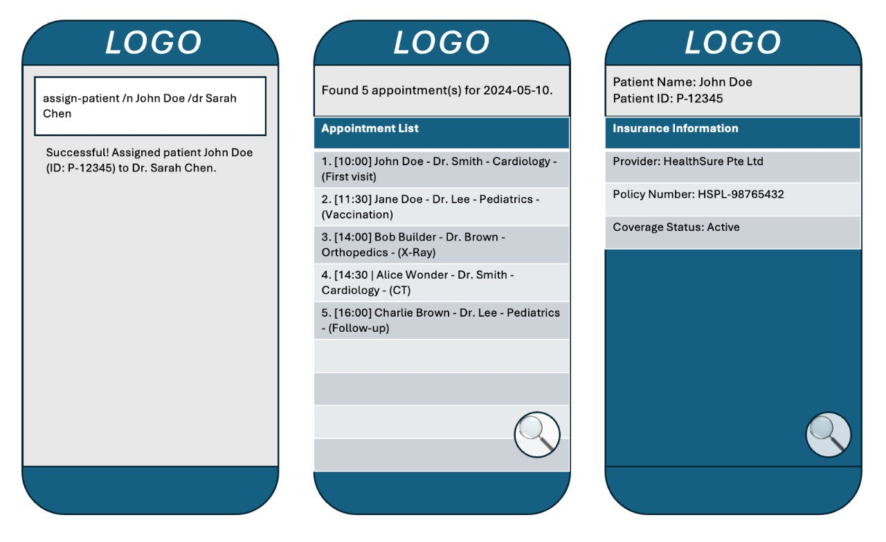

HospitalAdminProMax is a **desktop app built on AddressBook Level 3 (AB3) to help manage patient details in a high-volume patient environment**. We leverage the optimised nature of AB3 on the Command Line Interface (CLI) so if you can type fast, AB3 retrieves your patient details faster than traditional GUI apps. There still remains the benefits of a Graphical User Interface.

* Table of Contents
{:toc}

--------------------------------------------------------------------------------------------------------------------

## Quick start

1. Ensure you have Java `17` or above installed in your Computer. 
   **Mac users:** Ensure you have the precise JDK version prescribed [here](https://se-education.org/guides/tutorials/javaInstallationMac.html).

1. Download the latest `.jar` file from [here](https://github.com/se-edu/addressbook-level3/releases).

1. Copy the file to the folder you want to use as the _home folder_ for your AddressBook.

1. Open a command terminal, `cd` into the folder you put the jar file in, and use the `java -jar addressbook.jar` command to run the application. 
   A GUI similar to the below should appear in a few seconds. Note how the app contains some sample data. 
   

1. Type the command in the command box and press Enter to execute it. e.g. typing **`help`** and pressing Enter will open the help window. 
   Some example commands you can try:

   * `list` : Lists all contacts.

   * `add n/John Doe p/98765432 e/johnd@example.com a/John street, block 123, #01-01` : Adds a contact named `John Doe` to the Address Book.

   * `delete 3` : Deletes the 3rd contact shown in the current list.

   * `clear` : Deletes all contacts.

   * `exit` : Exits the app.

1. Refer to the [Features](#features) below for details of each command.

--------------------------------------------------------------------------------------------------------------------

## Features

**:information_source: Notes about the command format:** 

* Words in `UPPER_CASE` are the parameters to be supplied by the user. 
  e.g. in `add n/NAME`, `NAME` is a parameter which can be used as `add n/John Doe`.

* Items in square brackets are optional. 
  e.g `n/NAME [t/TAG]` can be used as `n/John Doe t/friend` or as `n/John Doe`.

* Items with `…`​ after them can be used multiple times including zero times. 
  e.g. `[t/TAG]…​` can be used as ` ` (i.e. 0 times), `t/friend`, `t/friend t/family` etc.

* Parameters can be in any order. 
  e.g. if the command specifies `n/NAME p/PHONE_NUMBER`, `p/PHONE_NUMBER n/NAME` is also acceptable.

* Extraneous parameters for commands that do not take in parameters (such as `help`, `list`, `exit` and `clear`) will be ignored. 
  e.g. if the command specifies `help 123`, it will be interpreted as `help`.

* If you are using a PDF version of this document, be careful when copying and pasting commands that span multiple lines as space characters surrounding line-breaks may be omitted when copied over to the application.

### Viewing help : `help`

Shows a message explaining how to access the help page.

Format: `help`

### Listing all patients : `list`

Shows a list of all patients in the address book.

Format: `list`

### Adding information of a patient: `i-add`

Adds a patient to the address book.

Format: `i-add n/NAME dob/BIRTHDAY g/GENDER p/PHONE e/EMAIL a/ADDRESS em/EMERGENCY id/ID_NUMBER lang/LANGUAGE`

* Add personal information of a new patient.
* Compulsory fields: name, birthday, gender, phone, emergency, id, lang.
* The date for birthday must follow the format YYYY-MM-DD.
* Currently, the app does not allow duplication in names.

Examples:
* `i-add n/John Tan dob/1990-05-15 g/Male p/98765432 e/johntan@example.com a/123 Main Street em/Jane Tan - 91234567
    id/S1234567A lang/English`
* `i-add n/Sarah Lim dob/1985-12-03 g/Female p/91234567 e/sarahlim@email.com a/456 Orchard Road em/David Lim - 87654321
    id/T9876543B lang/Chinese`

### Editing a patient : `edit`

Edits an existing patient in the address book.

Format: `edit INDEX [n/NAME] [p/PHONE] [e/EMAIL] [a/ADDRESS] [t/TAG]…​`

* Edits the patient at the specified `INDEX`. The index refers to the index number shown in the displayed patient list. The index **must be a positive integer** 1, 2, 3, …​
* At least one of the optional fields must be provided.
* Existing values will be updated to the input values.
* When editing tags, the existing tags of the patient will be removed i.e adding of tags is not cumulative.
* You can remove all the patient’s tags by typing `t/` without
  specifying any tags after it.

Examples:
*  `edit 1 p/91234567 e/johndoe@example.com` Edits the phone number and email address of the 1st patient to be `91234567` and `johndoe@example.com` respectively.
*  `edit 2 n/Betsy Crower t/` Edits the name of the 2nd patient to be `Betsy Crower` and clears all existing tags.

### Deleting a patient : `delete`

Deletes the specified patient from the address book.

Format: `delete INDEX`

* Deletes the patient at the specified `INDEX`.
* The index refers to the index number shown in the displayed patient list.
* The index **must be a positive integer** 1, 2, 3, …​

Examples:
* `list` followed by `delete 2` deletes the 2nd patient in the address book.
* `find Betsy` followed by `delete 1` deletes the 1st patient in the results of the `find` command.

### Locating patients by name: `find`

Finds patients whose names contain any of the given keywords.

Format: `find KEYWORD [MORE_KEYWORDS]`

* The search is case-insensitive. e.g `hans` will match `Hans`
* The order of the keywords does not matter. e.g. `Hans Bo` will match `Bo Hans`
* Only the name is searched.
* Only full words will be matched e.g. `Han` will not match `Hans`
* patients matching at least one keyword will be returned (i.e. `OR` search).
  e.g. `Hans Bo` will return `Hans Gruber`, `Bo Yang`

Examples:
* `find John` returns `john` and `John Doe`
* `find alex david` returns `Alex Yeoh`, `David Li` 
  

### Adding an appointment : `a-add`

Schedules a new appointment for a patient with a doctor.

Format: `a-add p/PATIENT_NAME d/DOCTOR_NAME dt/YYYY-MM-DD HH:MM [note/NOTE]`

* Creates a new appointment record for the specified patient and doctor.
* The NOTE field is optional and can include remarks such as visit purpose or follow-up notes.
* The date and time must follow the format YYYY-MM-DD HH:MM.
* The patient must already exist in the address book before scheduling an appointment.

Examples:
* a-add p/John Doe d/Dr Wee dt/2025-11-11 14:00 note/Fp
* a-add p/Betsy Crowe d/Dr Tan dt/2025-12-01 09:30 note/Annual check-up

### Viewing appointments: `a-view`

Displays all appointments scheduled for a specific patient, optionally filtered by a date range.

Format: `a-view p/<patient_name> [from/<YYYY-MM-DD>] [to/<YYYY-MM-DD>]`

* Shows all appointments associated with the specified patient.
* Optional to include a from and/or to date to filter appointments within a specific date range.
* If no date range is provided, all appointments for the patient will be shown.
* The patient must already exist in the address book.

Examples:
* `a-view p/John Doe` Displays all appointments for John Doe.
* `a-view p/John Doe from/2025-01-01 to/2025-12-31`Displays all appointments for John Doe scheduled
* between 1 January 2025 and 31 December 2025

### Delete patient appointments: `a-delete`

Delete all patient appointments from address book.

Format: `a-delete`

### Adding a prescription: `p-add`

Prescribe medication for a patient.

Format: `p-add p/PATIENT_NAME m/MEDICATION_NAME d/DOSAGE f/FREQUENCY dur/DURATION [s/STARTDATE n/NOTE]`

* Creates a new medication record for the specified patient.
* The DOSAGE is in milligrams.
* The DURATION is in days.
* The STARTDATE and NOTE field is optional.
* The STARTDATE field includes the day of starting medication and must follow the format YYYY-MM-DD HH:MM.
* The NOTE field include remarks such as medication reason or notes on special health conditions.
* The patient must already exist in the address book before scheduling an appointment.

Examples:
* p-add p/John Doe m/Panadol d/500 f/2 dur/3
* p-add p/Walter White m/Methamphetamine d/1000 f/3 dur/365 n/Yo

### Clearing all entries : `clear`

Clears all entries from the address book.

Format: `clear`

### Exiting the program : `exit`

Exits the program.

Format: `exit`

### Saving the data

AddressBook data are saved in the hard disk automatically after any command that changes the data. There is no need to save manually.

### Editing the data file

AddressBook data are saved automatically as a JSON file `[JAR file location]/data/addressbook.json`. Advanced users are welcome to update data directly by editing that data file.

:exclamation: **Caution:**
If your changes to the data file makes its format invalid, AddressBook will discard all data and start with an empty data file at the next run. Hence, it is recommended to take a backup of the file before editing it. 
Furthermore, certain edits can cause the AddressBook to behave in unexpected ways (e.g., if a value entered is outside of the acceptable range). Therefore, edit the data file only if you are confident that you can update it correctly.

### Archiving data files `[coming in v2.0]`

_Details coming soon ..._

--------------------------------------------------------------------------------------------------------------------

## FAQ

**Q**: How do I transfer my data to another Computer? 
**A**: Install the app in the other computer and overwrite the empty data file it creates with the file that contains the data of your previous AddressBook home folder.

--------------------------------------------------------------------------------------------------------------------

## Known issues

1. **When using multiple screens**, if you move the application to a secondary screen, and later switch to using only the primary screen, the GUI will open off-screen. The remedy is to delete the `preferences.json` file created by the application before running the application again.
2. **If you minimize the Help Window** and then run the `help` command (or use the `Help` menu, or the keyboard shortcut `F1`) again, the original Help Window will remain minimized, and no new Help Window will appear. The remedy is to manually restore the minimized Help Window.

--------------------------------------------------------------------------------------------------------------------

## Command summary

### General basic commands
Action | Format, Examples
--------|------------------
**Add** | `add n/NAME p/PHONE_NUMBER e/EMAIL a/ADDRESS [t/TAG]…​`   e.g., `add n/James Ho p/22224444 e/jamesho@example.com a/123, Clementi Rd, 1234665 t/friend t/colleague`
**Clear** | `clear`
**Delete** | `delete INDEX`  e.g., `delete 3`
**Edit** | `edit INDEX [n/NAME] [p/PHONE_NUMBER] [e/EMAIL] [a/ADDRESS] [t/TAG]…​`  e.g.,`edit 2 n/James Lee e/jameslee@example.com`
**Find** | `find KEYWORD [MORE_KEYWORDS]`  e.g., `find James Jake`
**List** | `list`
**Help** | `help`

### Appointment commands
Action | Format, Examples
--------|------------------
**Add Appointment** | `a-add p/PATIENT_NAME d/DOCTOR_NAME dt/YYYY-MM-DD HH:MM [note/NOTE]`   `e.g., a-add p/John Doe d/Dr Wee dt/2025-11-11 14:00 note/Fp`
**View Appointment** | `a-view p/<patient_name> [from/<YYYY-MM-DD>] [to/<YYYY-MM-DD>]`   `e.g., a-view p/John Doe from/2025-01-01 to/2025-12-31`
